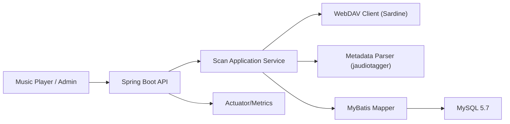

# WebDAV 音频扫描工具开发文档（技术设计）

## 1. 文档信息
- 文档名称：WebDAV 音频扫描工具开发文档
- 版本：v1.0
- 日期：2026-02-08
- 依据文档：`docs/webdav-music-scan-requirements.md`

## 2. 技术栈适配结论

你给出的技术栈：`Java 8 + Spring Boot + MyBatis + MySQL 5.7 + Sardine`，可实现一期目标，但还需要补齐少量关键组件。

### 2.1 现有技术栈可行性
- `Java 8`：可行，稳定；但并发与性能优化手段比新版本少。
- `Spring Boot`：可行，建议固定在 `2.7.x`（兼容 Java 8、生态完整）。
- `MyBatis`：可行，适合批量写入和手工 SQL 优化。
- `MySQL 5.7`：可行，但无窗口函数/CTE，复杂统计 SQL 要降级。
- `Sardine`：可行，适合 WebDAV 目录遍历与文件流读取。

### 2.2 必须新增（建议纳入一期）
1. 音频标签解析库：`jaudiotagger`
   - 原因：Sardine 只负责 WebDAV 通信，不解析 MP3/FLAC 标签。
2. 数据库变更管理：`Liquibase`
   - 原因：保证表结构演进可追溯、可回滚、可重复部署。
   - 约束：禁止手工改线上表结构，所有 DDL 通过 changelog 发布。
3. 服务观测组件：`Spring Boot Actuator + Micrometer`
   - 原因：满足健康检查、任务指标（FR-028/FR-029）。
4. 接口鉴权组件：`Spring Security`（最小化 Token 鉴权）
   - 原因：满足 NFR-009，避免查询接口裸露。

### 2.3 可选新增（二期或按规模引入）
1. `ShedLock`（基于 MySQL）
   - 用于多实例部署时防止重复触发定时扫描。
2. `Quartz`
   - 仅当调度策略复杂（节假日、错峰、手动优先级）时需要。
3. `Redis/RabbitMQ`
   - 仅当扫描任务量大、需异步队列削峰时引入。
4. `Elasticsearch`
   - 仅当搜索规模远超 MySQL LIKE 能力（百万级+复杂检索）时引入。

## 3. 总体架构设计

### 3.1 架构形态
- 一期建议：单体服务（API + 扫描任务同进程）+ MySQL。
- 原因：减少运维复杂度，优先交付稳定扫描与查询能力。

### 3.2 逻辑分层
1. `api`：REST 接口层（任务管理、歌曲查询、连接测试）。
2. `application`：用例编排（创建任务、执行扫描、汇总结果）。
3. `domain`：核心模型与业务规则（任务状态机、去重策略）。
4. `infrastructure`：
   - `webdav`（Sardine 封装）
   - `parser`（音频元数据解析）
   - `persistence`（MyBatis Mapper）
5. `scheduler`：定时触发增量扫描。

### 3.3 组件关系图


## 4. 项目结构建议

```text
src/main/java/com/example/musicwebdav
  ├── api
  │   ├── controller
  │   ├── request
  │   └── response
  ├── application
  │   ├── service
  │   └── job
  ├── domain
  │   ├── model
  │   ├── enum
  │   └── repository
  ├── infrastructure
  │   ├── webdav
  │   ├── parser
  │   ├── persistence
  │   │   ├── mapper
  │   │   └── entity
  │   └── security
  └── common
      ├── config
      ├── exception
      └── util
src/main/resources
  └── db/changelog
      ├── db.changelog-master.yaml
      └── changelog/
          ├── V1__init_schema.sql
          ├── V2__add_indexes.sql
          └── V3__track_source_config_scope.sql
```

## 5. 核心数据模型与 DDL（MySQL 5.7）

说明：考虑到 MySQL 5.7 对超长 `utf8mb4` 索引有约束，`source_path` 不直接建唯一索引，使用 `source_path_md5`；为支持多 WebDAV 配置并存，`track` 按 `source_config_id + source_path_md5` 复合唯一。

### 5.1 WebDAV 配置表
```sql
CREATE TABLE webdav_config (
  id BIGINT PRIMARY KEY AUTO_INCREMENT COMMENT '主键ID',
  name VARCHAR(64) NOT NULL COMMENT '配置名称',
  base_url VARCHAR(512) NOT NULL COMMENT 'WebDAV服务地址',
  username VARCHAR(128) NOT NULL COMMENT 'WebDAV用户名',
  password_enc VARCHAR(512) NOT NULL COMMENT '加密后的密码或令牌',
  root_path VARCHAR(1024) NOT NULL COMMENT '扫描根目录',
  enabled TINYINT NOT NULL DEFAULT 1 COMMENT '是否启用：1启用，0禁用',
  created_at DATETIME NOT NULL DEFAULT CURRENT_TIMESTAMP COMMENT '创建时间',
  updated_at DATETIME NOT NULL DEFAULT CURRENT_TIMESTAMP ON UPDATE CURRENT_TIMESTAMP COMMENT '更新时间',
  UNIQUE KEY uk_webdav_name (name)
) ENGINE=InnoDB DEFAULT CHARSET=utf8mb4 COMMENT='WebDAV连接配置表';
```

### 5.2 扫描任务表
```sql
CREATE TABLE scan_task (
  id BIGINT PRIMARY KEY AUTO_INCREMENT COMMENT '任务ID',
  task_type VARCHAR(16) NOT NULL COMMENT '任务类型：FULL全量，INCREMENTAL增量',
  status VARCHAR(24) NOT NULL COMMENT '任务状态：PENDING/RUNNING/SUCCESS/FAILED/PARTIAL_SUCCESS/CANCELED',
  config_id BIGINT NOT NULL COMMENT '关联WebDAV配置ID',
  start_time DATETIME NULL COMMENT '任务开始时间',
  end_time DATETIME NULL COMMENT '任务结束时间',
  total_files INT NOT NULL DEFAULT 0 COMMENT '扫描到的总文件数',
  audio_files INT NOT NULL DEFAULT 0 COMMENT '识别出的音频文件数',
  added_count INT NOT NULL DEFAULT 0 COMMENT '新增歌曲数',
  updated_count INT NOT NULL DEFAULT 0 COMMENT '更新歌曲数',
  deleted_count INT NOT NULL DEFAULT 0 COMMENT '软删除歌曲数',
  failed_count INT NOT NULL DEFAULT 0 COMMENT '失败文件数',
  error_summary VARCHAR(1000) NULL COMMENT '错误摘要信息',
  created_at DATETIME NOT NULL DEFAULT CURRENT_TIMESTAMP COMMENT '创建时间',
  updated_at DATETIME NOT NULL DEFAULT CURRENT_TIMESTAMP ON UPDATE CURRENT_TIMESTAMP COMMENT '更新时间',
  KEY idx_scan_task_status (status),
  KEY idx_scan_task_start_time (start_time),
  KEY idx_scan_task_config_id (config_id)
) ENGINE=InnoDB DEFAULT CHARSET=utf8mb4 COMMENT='扫描任务表';
```

### 5.3 扫描任务明细表
```sql
CREATE TABLE scan_task_item (
  id BIGINT PRIMARY KEY AUTO_INCREMENT COMMENT '明细ID',
  task_id BIGINT NOT NULL COMMENT '扫描任务ID',
  source_path VARCHAR(2048) NOT NULL COMMENT 'WebDAV文件相对路径',
  source_path_md5 CHAR(32) NOT NULL COMMENT '路径MD5（用于索引加速）',
  item_status VARCHAR(24) NOT NULL COMMENT '明细状态：SUCCESS/FAILED/SKIPPED',
  error_code VARCHAR(64) NULL COMMENT '错误码',
  error_message VARCHAR(1000) NULL COMMENT '错误信息',
  created_at DATETIME NOT NULL DEFAULT CURRENT_TIMESTAMP COMMENT '创建时间',
  KEY idx_scan_item_task_id (task_id),
  KEY idx_scan_item_status (item_status),
  KEY idx_scan_item_path_md5 (source_path_md5)
) ENGINE=InnoDB DEFAULT CHARSET=utf8mb4 COMMENT='扫描任务文件明细表';
```

### 5.4 扫描已发现集合表（用于删除检测）
```sql
CREATE TABLE scan_task_seen_file (
  id BIGINT PRIMARY KEY AUTO_INCREMENT COMMENT '主键ID',
  task_id BIGINT NOT NULL COMMENT '扫描任务ID',
  source_path_md5 CHAR(32) NOT NULL COMMENT '任务中发现的路径MD5',
  created_at DATETIME NOT NULL DEFAULT CURRENT_TIMESTAMP COMMENT '创建时间',
  UNIQUE KEY uk_task_seen_path (task_id, source_path_md5),
  KEY idx_seen_task_id (task_id)
) ENGINE=InnoDB DEFAULT CHARSET=utf8mb4 COMMENT='扫描任务已发现文件集合表';
```

### 5.5 歌曲主表
```sql
CREATE TABLE track (
  id BIGINT PRIMARY KEY AUTO_INCREMENT COMMENT '歌曲ID',
  source_config_id BIGINT NOT NULL COMMENT '来源WebDAV配置ID',
  source_path VARCHAR(2048) NOT NULL COMMENT 'WebDAV文件相对路径',
  source_path_md5 CHAR(32) NOT NULL COMMENT '路径MD5（配置内唯一）',
  source_etag VARCHAR(255) NULL COMMENT 'WebDAV ETag',
  source_last_modified DATETIME NULL COMMENT '源文件最后修改时间',
  source_size BIGINT NULL COMMENT '源文件大小（字节）',
  mime_type VARCHAR(128) NULL COMMENT '文件MIME类型',
  content_hash CHAR(64) NULL COMMENT '文件内容哈希（可选）',
  title VARCHAR(512) NOT NULL COMMENT '歌曲标题',
  artist VARCHAR(512) NOT NULL COMMENT '歌手',
  album VARCHAR(512) NOT NULL COMMENT '专辑',
  album_artist VARCHAR(512) NULL COMMENT '专辑歌手',
  track_no INT NULL COMMENT '曲目号',
  disc_no INT NULL COMMENT '碟片序号',
  year INT NULL COMMENT '发行年份',
  genre VARCHAR(255) NULL COMMENT '流派',
  duration_sec INT NULL COMMENT '时长（秒）',
  bitrate INT NULL COMMENT '码率（kbps）',
  sample_rate INT NULL COMMENT '采样率（Hz）',
  channels INT NULL COMMENT '声道数',
  has_cover TINYINT NOT NULL DEFAULT 0 COMMENT '是否有封面：1有，0无',
  is_deleted TINYINT NOT NULL DEFAULT 0 COMMENT '是否软删除：1已删除，0正常',
  last_scan_task_id BIGINT NULL COMMENT '最后一次更新该记录的任务ID',
  created_at DATETIME NOT NULL DEFAULT CURRENT_TIMESTAMP COMMENT '创建时间',
  updated_at DATETIME NOT NULL DEFAULT CURRENT_TIMESTAMP ON UPDATE CURRENT_TIMESTAMP COMMENT '更新时间',
  UNIQUE KEY uk_track_config_path_md5 (source_config_id, source_path_md5),
  KEY idx_track_source_config_deleted (source_config_id, is_deleted),
  KEY idx_track_title_artist_album (title(191), artist(191), album(191)),
  KEY idx_track_artist (artist(191)),
  KEY idx_track_album (album(191)),
  KEY idx_track_updated_at (updated_at),
  KEY idx_track_is_deleted (is_deleted)
) ENGINE=InnoDB DEFAULT CHARSET=utf8mb4 COMMENT='歌曲信息表';
```

## 6. 核心流程设计

### 6.1 扫描任务状态机
`PENDING -> RUNNING -> SUCCESS | PARTIAL_SUCCESS | FAILED | CANCELED`

状态变更原则：
- 启动任务后立即写 `RUNNING` + `start_time`。
- 任何不可恢复异常 -> `FAILED`。
- 存在失败文件但任务主体完成 -> `PARTIAL_SUCCESS`。
- 手动取消 -> `CANCELED`（保留统计）。

### 6.2 全量/增量统一扫描流程
1. 创建任务记录。
2. 遍历 WebDAV 根目录（递归）。
3. 对每个音频文件写入 `scan_task_seen_file`。
4. 读取数据库旧记录，比较指纹：
   - 指纹一致：跳过解析，记 `SKIPPED`。
   - 新增或变更：读取文件流，解析标签，执行 Upsert。
5. 遍历结束后执行软删除：
   - 仅对当前 `config_id` 下，`track` 中不在 `scan_task_seen_file` 的记录标记 `is_deleted=1`。
6. 汇总统计，更新任务终态。

### 6.3 指纹策略
优先级：
1. `etag` 可用时：`path + etag`
2. 否则：`path + last_modified + size`
3. 对关键场景可开启 `content_hash`（成本高，默认关闭）

## 7. 核心实现方案

### 7.1 WebDAV 访问封装（Sardine）
- 封装接口：
  - `list(String path): List<WebDavObject>`
  - `get(String path): InputStream`
  - `testConnection()`
- 异常统一转业务错误码：
  - `WEBDAV_AUTH_FAILED`
  - `WEBDAV_TIMEOUT`
  - `WEBDAV_NOT_FOUND`

### 7.2 元数据解析
- 使用 `jaudiotagger` 从临时文件解析（InputStream 先落地临时文件）。
- 解析字段：标题、歌手、专辑、时长、码率、采样率等。
- 回退规则：
  - `title` 缺失 -> 文件名（去后缀）
  - `artist` 缺失 -> `Unknown Artist`
  - `album` 缺失 -> `Unknown Album`

### 7.3 数据写入策略（MyBatis）
- 批量写入建议：每批 `200~500` 首。
- Upsert 语句使用 `INSERT ... ON DUPLICATE KEY UPDATE`。
- 对 `scan_task_item` 失败明细可异步批量写入，减少主链路阻塞。

示例 Upsert SQL：
```sql
INSERT INTO track (
  source_config_id, source_path, source_path_md5, source_etag, source_last_modified, source_size, mime_type,
  title, artist, album, album_artist, track_no, disc_no, year, genre,
  duration_sec, bitrate, sample_rate, channels, has_cover, is_deleted, last_scan_task_id
) VALUES (
  #{sourceConfigId}, #{sourcePath}, #{sourcePathMd5}, #{sourceEtag}, #{sourceLastModified}, #{sourceSize}, #{mimeType},
  #{title}, #{artist}, #{album}, #{albumArtist}, #{trackNo}, #{discNo}, #{year}, #{genre},
  #{durationSec}, #{bitrate}, #{sampleRate}, #{channels}, #{hasCover}, 0, #{taskId}
)
ON DUPLICATE KEY UPDATE
  source_config_id = VALUES(source_config_id),
  source_etag = VALUES(source_etag),
  source_last_modified = VALUES(source_last_modified),
  source_size = VALUES(source_size),
  mime_type = VALUES(mime_type),
  title = VALUES(title),
  artist = VALUES(artist),
  album = VALUES(album),
  album_artist = VALUES(album_artist),
  track_no = VALUES(track_no),
  disc_no = VALUES(disc_no),
  year = VALUES(year),
  genre = VALUES(genre),
  duration_sec = VALUES(duration_sec),
  bitrate = VALUES(bitrate),
  sample_rate = VALUES(sample_rate),
  channels = VALUES(channels),
  has_cover = VALUES(has_cover),
  is_deleted = 0,
  last_scan_task_id = VALUES(last_scan_task_id);
```

### 7.4 软删除 SQL
```sql
UPDATE track t
LEFT JOIN scan_task_seen_file s
  ON s.task_id = #{taskId}
 AND s.source_path_md5 = t.source_path_md5
SET t.is_deleted = 1,
    t.updated_at = NOW()
WHERE s.id IS NULL
  AND t.is_deleted = 0
  AND t.source_config_id = #{configId};
```

## 8. API 设计（v1）

### 8.1 管理类 API
1. `POST /api/v1/webdav/test`
   - 入参：`baseUrl, username, password, rootPath`
   - 出参：`success, message, latencyMs`
2. `POST /api/v1/scan/tasks`
   - 入参：`taskType(FULL|INCREMENTAL), configId`
   - 出参：`taskId, status`
3. `GET /api/v1/scan/tasks/{id}`
   - 出参：任务详情和统计。
4. `POST /api/v1/scan/tasks/{id}/cancel`
   - 出参：取消结果。

### 8.2 查询类 API
1. `GET /api/v1/tracks`
   - 参数：`pageNo,pageSize,keyword,artist,album,genre,year,sortBy,sortOrder`
2. `GET /api/v1/tracks/{id}`
3. `GET /api/v1/tracks/search?q=...`

### 8.3 统一响应体
```json
{
  "code": "0",
  "message": "OK",
  "data": {}
}
```

## 9. 安全设计
- 鉴权：`Bearer Token`（一期可使用静态 Token + 过期时间）。
- 敏感信息：
  - `password_enc` 使用 AES 加密存库。
  - 日志脱敏输出（账号可见，密码不可见）。
- 通信：生产强制 HTTPS。

## 10. 并发与调度设计

### 10.1 并发策略
- 默认单任务串行，避免 I/O 与 DB 写竞争导致整体抖动。
- 文件解析阶段可配置固定线程池（例如 `4~8`）。
- 同时仅允许一个 `RUNNING` 任务（数据库乐观校验）。

### 10.2 定时策略
- 使用 Spring `@Scheduled` 触发日常增量扫描。
- 若后续多实例部署，建议加 `ShedLock`。

## 11. 配置项设计

```yaml
app:
  scan:
    batch-size: 300
    parser-thread-count: 6
    max-retry: 3
    retry-backoff-ms: 500
    audio-extensions: mp3,flac,m4a,aac,ogg,wav
    incremental-cron: "0 0 3 * * ?"
  security:
    api-token: "replace-me"
  webdav:
    connect-timeout-ms: 5000
    socket-timeout-ms: 15000
```

## 12. 日志与监控
- 日志建议：
  - `taskId`、`pathMd5`、错误码、耗时。
- Actuator 端点：
  - `/actuator/health`
  - `/actuator/metrics`
- 核心指标：
  - 扫描任务成功率
  - 平均扫描耗时
  - 文件解析失败率
  - 每分钟入库条数

## 12.1 Liquibase 变更规范
- 主文件：`db/changelog/db.changelog-master.yaml`
- 变更文件：`db/changelog/changelog/V{版本号}__{描述}.sql`
- 规则：
  - 一个变更集只做一类变更（建表/加索引/字段变更）。
  - 禁止修改已上线的历史变更文件；新增版本文件向后追加。
  - 生产发布前先在预发执行 `update` 并校验回滚脚本。
- Spring Boot 配置建议：
  - `spring.liquibase.enabled=true`
  - `spring.liquibase.change-log=classpath:db/changelog/db.changelog-master.yaml`

## 13. 测试策略

### 13.1 单元测试
- 指纹比较逻辑
- 元数据回退规则
- 任务状态机流转

### 13.2 集成测试
- WebDAV 目录遍历+入库联调
- 全量与增量扫描正确性
- 删除检测与软删除

### 13.3 性能测试
- 10 万文件样本目录：
  - 全量扫描耗时
  - 增量扫描耗时
  - 查询 API P95

## 14. 发布与运维

### 14.1 部署方式
- 单体 Jar + MySQL 5.7（首选）
- 可容器化（Docker）但非强依赖

### 14.2 发布流程
1. 执行 Liquibase `update`（先预发后生产）。
2. 灰度验证连接测试与健康检查。
3. 触发一次全量扫描初始化曲库。
4. 开启定时增量扫描。

## 15. 开发里程碑（建议）
1. 第 1 周：项目骨架、Liquibase、基础表结构、WebDAV 连接测试
2. 第 2 周：全量扫描链路（遍历、解析、入库、任务状态）
3. 第 3 周：增量扫描、删除检测、查询 API
4. 第 4 周：安全、监控、压测、上线验收

## 16. 对当前技术栈的最终建议

结论：你提供的主技术栈可以作为一期落地方案，不需要重构成微服务，也不需要立即引入中间件。  
但请至少新增以下能力，否则无法完整满足需求文档：

1. 音频标签解析库（必须）
2. DB Migration 工具 `Liquibase`（必须）
3. Actuator/Metrics（必须）
4. 接口鉴权（必须）

其余技术（ShedLock、Quartz、Redis、ES）按规模演进再引入即可。
