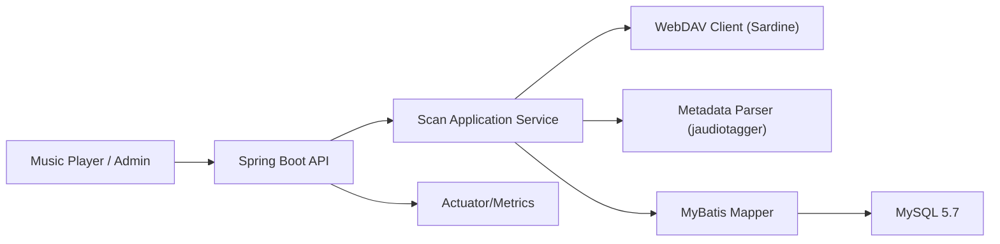

# WebDAV 音频扫描工具开发文档（技术设计）

## 1. 文档信息
- 文档名称：WebDAV 音频扫描工具开发文档
- 版本：v2.0
- 日期：2026-02-09（v2.0 扫描优化）/ 2026-02-08（v1.0 初始版本）
- 依据文档：`docs/webdav-music-scan-requirements.md`

## 2. 技术栈适配结论

你给出的技术栈：`Java 8 + Spring Boot + MyBatis + MySQL 5.7 + Sardine`，可实现一期目标，但还需要补齐少量关键组件。

### 2.1 现有技术栈可行性
- `Java 8`：可行，稳定；但并发与性能优化手段比新版本少。
- `Spring Boot`：可行，建议固定在 `2.7.x`（兼容 Java 8、生态完整）。
- `MyBatis`：可行，适合批量写入和手工 SQL 优化。
- `MySQL 5.7`：可行，但无窗口函数/CTE，复杂统计 SQL 要降级。
- `Sardine`：可行，适合 WebDAV 目录遍历与文件流读取。

### 2.2 必须新增（建议纳入一期）
1. 音频标签解析库：`jaudiotagger`
   - 原因：Sardine 只负责 WebDAV 通信，不解析 MP3/FLAC 标签。
2. 数据库变更管理：`Liquibase`
   - 原因：保证表结构演进可追溯、可回滚、可重复部署。
   - 约束：禁止手工改线上表结构，所有 DDL 通过 changelog 发布。
3. 服务观测组件：`Spring Boot Actuator + Micrometer`
   - 原因：满足健康检查、任务指标（FR-028/FR-029）。
4. 接口鉴权组件：`Spring Security`（最小化 Token 鉴权）
   - 原因：满足 NFR-009，避免查询接口裸露。

### 2.3 可选新增（二期或按规模引入）
1. `ShedLock`（基于 MySQL）
   - 用于多实例部署时防止重复触发定时扫描。
2. `Quartz`
   - 仅当调度策略复杂（节假日、错峰、手动优先级）时需要。
3. `Redis/RabbitMQ`
   - 仅当扫描任务量大、需异步队列削峰时引入。
4. `Elasticsearch`
   - 仅当搜索规模远超 MySQL LIKE 能力（百万级+复杂检索）时引入。

## 3. 总体架构设计

### 3.1 架构形态
- 一期建议：单体服务（API + 扫描任务同进程）+ MySQL。
- 原因：减少运维复杂度，优先交付稳定扫描与查询能力。

### 3.2 逻辑分层
1. `api`：REST 接口层（任务管理、歌曲查询、连接测试）。
2. `application`：用例编排（创建任务、执行扫描、汇总结果）。
3. `domain`：核心模型与业务规则（任务状态机、去重策略）。
4. `infrastructure`：
   - `webdav`（Sardine 封装）
   - `parser`（音频元数据解析）
   - `persistence`（MyBatis Mapper）
5. `scheduler`：定时触发增量扫描。

### 3.3 组件关系图


## 4. 项目结构建议

```text
src/main/java/com/example/musicwebdav
  ├── api
  │   ├── controller
  │   ├── request
  │   └── response
  ├── application
  │   ├── service
  │   └── job
  ├── domain
  │   ├── model
  │   ├── enum
  │   └── repository
  ├── infrastructure
  │   ├── webdav
  │   ├── parser
  │   ├── persistence
  │   │   ├── mapper
  │   │   └── entity
  │   └── security
  └── common
      ├── config
      ├── exception
      └── util
src/main/resources
  ├── mapper/
  │   ├── TrackMapper.xml              (v2 新增, 批量 upsert)
  │   └── ScanTaskSeenFileMapper.xml   (v2 新增, 批量 insert)
  └── db/changelog
      ├── db.changelog-master.yaml
      └── changelog/
          ├── V1__init_schema.sql
          ├── V2__add_indexes.sql
          ├── V3__track_source_config_scope.sql
          └── V4__optimization_features.sql  (v2 新增)
```

## 5. 核心数据模型与 DDL（MySQL 5.7）

说明：考虑到 MySQL 5.7 对超长 `utf8mb4` 索引有约束，`source_path` 不直接建唯一索引，使用 `source_path_md5`；为支持多 WebDAV 配置并存，`track` 按 `source_config_id + source_path_md5` 复合唯一。

### 5.1 WebDAV 配置表
```sql
CREATE TABLE webdav_config (
  id BIGINT PRIMARY KEY AUTO_INCREMENT COMMENT '主键ID',
  name VARCHAR(64) NOT NULL COMMENT '配置名称',
  base_url VARCHAR(512) NOT NULL COMMENT 'WebDAV服务地址',
  username VARCHAR(128) NOT NULL COMMENT 'WebDAV用户名',
  password_enc VARCHAR(512) NOT NULL COMMENT '加密后的密码或令牌',
  root_path VARCHAR(1024) NOT NULL COMMENT '扫描根目录',
  enabled TINYINT NOT NULL DEFAULT 1 COMMENT '是否启用：1启用，0禁用',
  created_at DATETIME NOT NULL DEFAULT CURRENT_TIMESTAMP COMMENT '创建时间',
  updated_at DATETIME NOT NULL DEFAULT CURRENT_TIMESTAMP ON UPDATE CURRENT_TIMESTAMP COMMENT '更新时间',
  UNIQUE KEY uk_webdav_name (name)
) ENGINE=InnoDB DEFAULT CHARSET=utf8mb4 COMMENT='WebDAV连接配置表';
```

### 5.2 扫描任务表
```sql
CREATE TABLE scan_task (
  id BIGINT PRIMARY KEY AUTO_INCREMENT COMMENT '任务ID',
  task_type VARCHAR(16) NOT NULL COMMENT '任务类型：FULL全量，INCREMENTAL增量',
  status VARCHAR(24) NOT NULL COMMENT '任务状态：PENDING/RUNNING/SUCCESS/FAILED/PARTIAL_SUCCESS/CANCELED',
  config_id BIGINT NOT NULL COMMENT '关联WebDAV配置ID',
  start_time DATETIME NULL COMMENT '任务开始时间',
  end_time DATETIME NULL COMMENT '任务结束时间',
  total_files INT NOT NULL DEFAULT 0 COMMENT '扫描到的总文件数',
  audio_files INT NOT NULL DEFAULT 0 COMMENT '识别出的音频文件数',
  added_count INT NOT NULL DEFAULT 0 COMMENT '新增歌曲数',
  updated_count INT NOT NULL DEFAULT 0 COMMENT '更新歌曲数',
  deleted_count INT NOT NULL DEFAULT 0 COMMENT '软删除歌曲数',
  failed_count INT NOT NULL DEFAULT 0 COMMENT '失败文件数',
  error_summary VARCHAR(1000) NULL COMMENT '错误摘要信息',
  created_at DATETIME NOT NULL DEFAULT CURRENT_TIMESTAMP COMMENT '创建时间',
  updated_at DATETIME NOT NULL DEFAULT CURRENT_TIMESTAMP ON UPDATE CURRENT_TIMESTAMP COMMENT '更新时间',
  KEY idx_scan_task_status (status),
  KEY idx_scan_task_start_time (start_time),
  KEY idx_scan_task_config_id (config_id)
) ENGINE=InnoDB DEFAULT CHARSET=utf8mb4 COMMENT='扫描任务表';
```

### 5.3 扫描任务明细表
```sql
CREATE TABLE scan_task_item (
  id BIGINT PRIMARY KEY AUTO_INCREMENT COMMENT '明细ID',
  task_id BIGINT NOT NULL COMMENT '扫描任务ID',
  source_path VARCHAR(2048) NOT NULL COMMENT 'WebDAV文件相对路径',
  source_path_md5 CHAR(32) NOT NULL COMMENT '路径MD5（用于索引加速）',
  item_status VARCHAR(24) NOT NULL COMMENT '明细状态：SUCCESS/FAILED/SKIPPED',
  error_code VARCHAR(64) NULL COMMENT '错误码',
  error_message VARCHAR(1000) NULL COMMENT '错误信息',
  created_at DATETIME NOT NULL DEFAULT CURRENT_TIMESTAMP COMMENT '创建时间',
  KEY idx_scan_item_task_id (task_id),
  KEY idx_scan_item_status (item_status),
  KEY idx_scan_item_path_md5 (source_path_md5)
) ENGINE=InnoDB DEFAULT CHARSET=utf8mb4 COMMENT='扫描任务文件明细表';
```

### 5.4 扫描已发现集合表（用于删除检测）
```sql
CREATE TABLE scan_task_seen_file (
  id BIGINT PRIMARY KEY AUTO_INCREMENT COMMENT '主键ID',
  task_id BIGINT NOT NULL COMMENT '扫描任务ID',
  source_path_md5 CHAR(32) NOT NULL COMMENT '任务中发现的路径MD5',
  created_at DATETIME NOT NULL DEFAULT CURRENT_TIMESTAMP COMMENT '创建时间',
  UNIQUE KEY uk_task_seen_path (task_id, source_path_md5),
  KEY idx_seen_task_id (task_id)
) ENGINE=InnoDB DEFAULT CHARSET=utf8mb4 COMMENT='扫描任务已发现文件集合表';
```

### 5.5 歌曲主表
```sql
CREATE TABLE track (
  id BIGINT PRIMARY KEY AUTO_INCREMENT COMMENT '歌曲ID',
  source_config_id BIGINT NOT NULL COMMENT '来源WebDAV配置ID',
  source_path VARCHAR(2048) NOT NULL COMMENT 'WebDAV文件相对路径',
  source_path_md5 CHAR(32) NOT NULL COMMENT '路径MD5（配置内唯一）',
  source_etag VARCHAR(255) NULL COMMENT 'WebDAV ETag',
  source_last_modified DATETIME NULL COMMENT '源文件最后修改时间',
  source_size BIGINT NULL COMMENT '源文件大小（字节）',
  mime_type VARCHAR(128) NULL COMMENT '文件MIME类型',
  content_hash CHAR(64) NULL COMMENT '文件内容哈希（可选）',
  title VARCHAR(512) NOT NULL COMMENT '歌曲标题',
  artist VARCHAR(512) NOT NULL COMMENT '歌手',
  album VARCHAR(512) NOT NULL COMMENT '专辑',
  album_artist VARCHAR(512) NULL COMMENT '专辑歌手',
  track_no INT NULL COMMENT '曲目号',
  disc_no INT NULL COMMENT '碟片序号',
  year INT NULL COMMENT '发行年份',
  genre VARCHAR(255) NULL COMMENT '流派',
  duration_sec INT NULL COMMENT '时长（秒）',
  bitrate INT NULL COMMENT '码率（kbps）',
  sample_rate INT NULL COMMENT '采样率（Hz）',
  channels INT NULL COMMENT '声道数',
  has_cover TINYINT NOT NULL DEFAULT 0 COMMENT '是否有封面：1有，0无',
  is_deleted TINYINT NOT NULL DEFAULT 0 COMMENT '是否软删除：1已删除，0正常',
  last_scan_task_id BIGINT NULL COMMENT '最后一次更新该记录的任务ID',
  created_at DATETIME NOT NULL DEFAULT CURRENT_TIMESTAMP COMMENT '创建时间',
  updated_at DATETIME NOT NULL DEFAULT CURRENT_TIMESTAMP ON UPDATE CURRENT_TIMESTAMP COMMENT '更新时间',
  UNIQUE KEY uk_track_config_path_md5 (source_config_id, source_path_md5),
  KEY idx_track_source_config_deleted (source_config_id, is_deleted),
  KEY idx_track_title_artist_album (title(191), artist(191), album(191)),
  KEY idx_track_artist (artist(191)),
  KEY idx_track_album (album(191)),
  KEY idx_track_updated_at (updated_at),
  KEY idx_track_is_deleted (is_deleted)
) ENGINE=InnoDB DEFAULT CHARSET=utf8mb4 COMMENT='歌曲信息表';
```

## 6. 核心流程设计

### 6.1 扫描任务状态机
`PENDING -> RUNNING -> SUCCESS | PARTIAL_SUCCESS | FAILED | CANCELED`

状态变更原则：
- 启动任务后立即写 `RUNNING` + `start_time`。
- 任何不可恢复异常 -> `FAILED`。
- 存在失败文件但任务主体完成 -> `PARTIAL_SUCCESS`。
- 手动取消 -> `CANCELED`（保留统计）。

### 6.2 全量/增量统一扫描流程
1. 创建任务记录。
2. 遍历 WebDAV 根目录（递归）。
3. 对每个音频文件写入 `scan_task_seen_file`。
4. 读取数据库旧记录，比较指纹：
   - 指纹一致：跳过解析，记 `SKIPPED`。
   - 新增或变更：读取文件流，解析标签，执行 Upsert。
5. 遍历结束后执行软删除：
   - 仅对当前 `config_id` 下，`track` 中不在 `scan_task_seen_file` 的记录标记 `is_deleted=1`。
6. 汇总统计，更新任务终态。

### 6.3 指纹策略
优先级：
1. `etag` 可用时：`path + etag`
2. 否则：`path + last_modified + size`
3. 对关键场景可开启 `content_hash`（成本高，默认关闭）

## 7. 核心实现方案

### 7.1 WebDAV 访问封装（Sardine）
- 封装接口：
  - `list(String path): List<WebDavObject>`
  - `get(String path): InputStream`
  - `testConnection()`
- 异常统一转业务错误码：
  - `WEBDAV_AUTH_FAILED`
  - `WEBDAV_TIMEOUT`
  - `WEBDAV_NOT_FOUND`

### 7.2 元数据解析
- 使用 `jaudiotagger` 从临时文件解析（InputStream 先落地临时文件）。
- 解析字段：标题、歌手、专辑、时长、码率、采样率等。
- 回退规则：
  - `title` 缺失 -> 文件名（去后缀）
  - `artist` 缺失 -> `Unknown Artist`
  - `album` 缺失 -> `Unknown Album`

### 7.3 数据写入策略（MyBatis）
- 批量写入建议：每批 `200~500` 首。
- Upsert 语句使用 `INSERT ... ON DUPLICATE KEY UPDATE`。
- 对 `scan_task_item` 失败明细可异步批量写入，减少主链路阻塞。

示例 Upsert SQL：
```sql
INSERT INTO track (
  source_config_id, source_path, source_path_md5, source_etag, source_last_modified, source_size, mime_type,
  title, artist, album, album_artist, track_no, disc_no, year, genre,
  duration_sec, bitrate, sample_rate, channels, has_cover, is_deleted, last_scan_task_id
) VALUES (
  #{sourceConfigId}, #{sourcePath}, #{sourcePathMd5}, #{sourceEtag}, #{sourceLastModified}, #{sourceSize}, #{mimeType},
  #{title}, #{artist}, #{album}, #{albumArtist}, #{trackNo}, #{discNo}, #{year}, #{genre},
  #{durationSec}, #{bitrate}, #{sampleRate}, #{channels}, #{hasCover}, 0, #{taskId}
)
ON DUPLICATE KEY UPDATE
  source_config_id = VALUES(source_config_id),
  source_etag = VALUES(source_etag),
  source_last_modified = VALUES(source_last_modified),
  source_size = VALUES(source_size),
  mime_type = VALUES(mime_type),
  title = VALUES(title),
  artist = VALUES(artist),
  album = VALUES(album),
  album_artist = VALUES(album_artist),
  track_no = VALUES(track_no),
  disc_no = VALUES(disc_no),
  year = VALUES(year),
  genre = VALUES(genre),
  duration_sec = VALUES(duration_sec),
  bitrate = VALUES(bitrate),
  sample_rate = VALUES(sample_rate),
  channels = VALUES(channels),
  has_cover = VALUES(has_cover),
  is_deleted = 0,
  last_scan_task_id = VALUES(last_scan_task_id);
```

### 7.4 软删除 SQL
```sql
UPDATE track t
LEFT JOIN scan_task_seen_file s
  ON s.task_id = #{taskId}
 AND s.source_path_md5 = t.source_path_md5
SET t.is_deleted = 1,
    t.updated_at = NOW()
WHERE s.id IS NULL
  AND t.is_deleted = 0
  AND t.source_config_id = #{configId};
```

## 8. API 设计（v1）

### 8.1 管理类 API
1. `POST /api/v1/webdav/test`
   - 入参：`baseUrl, username, password, rootPath`
   - 出参：`success, message, latencyMs`
2. `POST /api/v1/scan/tasks`
   - 入参：`taskType(FULL|INCREMENTAL), configId`
   - 出参：`taskId, status`
3. `GET /api/v1/scan/tasks/{id}`
   - 出参：任务详情和统计。
4. `POST /api/v1/scan/tasks/{id}/cancel`
   - 出参：取消结果。

### 8.2 查询类 API
1. `GET /api/v1/tracks`
   - 参数：`pageNo,pageSize,keyword,artist,album,genre,year,sortBy,sortOrder`
2. `GET /api/v1/tracks/{id}`
3. `GET /api/v1/tracks/search?q=...`

### 8.3 统一响应体
```json
{
  "code": "0",
  "message": "OK",
  "data": {}
}
```

## 9. 安全设计
- 鉴权：`Bearer Token`（一期可使用静态 Token + 过期时间）。
- 敏感信息：
  - `password_enc` 使用 AES 加密存库。
  - 日志脱敏输出（账号可见，密码不可见）。
- 通信：生产强制 HTTPS。

## 10. 并发与调度设计

### 10.1 并发策略
- 默认单任务串行，避免 I/O 与 DB 写竞争导致整体抖动。
- 文件解析阶段可配置固定线程池（例如 `4~8`）。
- 同时仅允许一个 `RUNNING` 任务（数据库乐观校验）。

### 10.2 定时策略
- 使用 Spring `@Scheduled` 触发日常增量扫描。
- 若后续多实例部署，建议加 `ShedLock`。

## 11. 配置项设计

```yaml
app:
  scan:
    batch-size: 300
    parser-thread-count: 6
    max-retry: 3
    retry-backoff-ms: 500
    audio-extensions: mp3,flac,m4a,aac,ogg,wav
    incremental-cron: "0 0 3 * * ?"
  security:
    api-token: "replace-me"
  webdav:
    connect-timeout-ms: 5000
    socket-timeout-ms: 15000
```

## 12. 日志与监控
- 日志建议：
  - `taskId`、`pathMd5`、错误码、耗时。
- Actuator 端点：
  - `/actuator/health`
  - `/actuator/metrics`
- 核心指标：
  - 扫描任务成功率
  - 平均扫描耗时
  - 文件解析失败率
  - 每分钟入库条数

## 12.1 Liquibase 变更规范
- 主文件：`db/changelog/db.changelog-master.yaml`
- 变更文件：`db/changelog/changelog/V{版本号}__{描述}.sql`
- 规则：
  - 一个变更集只做一类变更（建表/加索引/字段变更）。
  - 禁止修改已上线的历史变更文件；新增版本文件向后追加。
  - 生产发布前先在预发执行 `update` 并校验回滚脚本。
- Spring Boot 配置建议：
  - `spring.liquibase.enabled=true`
  - `spring.liquibase.change-log=classpath:db/changelog/db.changelog-master.yaml`

## 13. 测试策略

### 13.1 单元测试
- 指纹比较逻辑
- 元数据回退规则
- 任务状态机流转

### 13.2 集成测试
- WebDAV 目录遍历+入库联调
- 全量与增量扫描正确性
- 删除检测与软删除

### 13.3 性能测试
- 10 万文件样本目录：
  - 全量扫描耗时
  - 增量扫描耗时
  - 查询 API P95

## 14. 发布与运维

### 14.1 部署方式
- 单体 Jar + MySQL 5.7（首选）
- 可容器化（Docker）但非强依赖

### 14.2 发布流程
1. 执行 Liquibase `update`（先预发后生产）。
2. 灰度验证连接测试与健康检查。
3. 触发一次全量扫描初始化曲库。
4. 开启定时增量扫描。

## 15. 开发里程碑（建议）
1. 第 1 周：项目骨架、Liquibase、基础表结构、WebDAV 连接测试
2. 第 2 周：全量扫描链路（遍历、解析、入库、任务状态）
3. 第 3 周：增量扫描、删除检测、查询 API
4. 第 4 周：安全、监控、压测、上线验收

## 16. 对当前技术栈的最终建议

结论：你提供的主技术栈可以作为一期落地方案，不需要重构成微服务，也不需要立即引入中间件。  
但请至少新增以下能力，否则无法完整满足需求文档：

1. 音频标签解析库（必须）
2. DB Migration 工具 `Liquibase`（必须）
3. Actuator/Metrics（必须）
4. 接口鉴权（必须）

其余技术（ShedLock、Quartz、Redis、ES）按规模演进再引入即可。

---

## 17. v2 优化：扫描性能与功能增强

### 17.1 变更概述
- 版本：v2.0
- 日期：2026-02-09
- 目标：将扫描架构从「先收集所有文件再逐个处理」重构为**逐目录流式管线**，支持 TB 级库；同时引入 HTTP Range 部分下载、批量 DB 写入、目录级增量判断、断点续扫、进度持久化、封面映射、重复过滤等 8 项优化。

### 17.2 Feature 清单

| # | Feature | 核心改动 |
|---|---------|---------|
| 1 | 文件名/目录推断标题与歌手 | `MetadataFallbackService` 增强 |
| 2 | 重复歌曲过滤 | 新增 `DuplicateFilterService` |
| 3 | 目录封面映射 | 新增 `CoverArtDetector` |
| 4 | 目录级增量判断 | 新增 `directory_signature` 表 |
| 5 | 扫描进度日志 | 新增 `ScanProgressTracker` |
| 6 | 检查点与失败重试 | 新增 `scan_checkpoint` 表 |
| 7 | 进度与状态落盘 | `scan_task` 表新增进度字段 |
| 8 | TB 级速度优化 | 管线架构 + Range 下载 + 批量 DB + 会话复用 |

### 17.3 核心架构变更：管线扫描

#### Before（v1）
```
listFiles() 递归全部目录
    → 返回 List<WebDavFileObject>（内存爆炸风险）
    → 逐个下载完整文件（几 MB ~ 几十 MB）
    → 逐条 DB 操作
    → 每次新建 Sardine 连接
```

#### After（v2）
```
BFS 逐目录发现
    → 每个目录立即处理（内存仅持有当前目录文件）
    → HTTP Range 部分下载（128KB 头 + 128B 尾）
    → 批量 INSERT...ON DUPLICATE KEY UPDATE
    → 整个任务复用同一 Sardine 会话
```

#### 管线主循环伪代码
```java
Deque<String> dirQueue = new ArrayDeque<>();
dirQueue.push(rootUrl);

while (!dirQueue.isEmpty() && !canceled) {
    WebDavDirectoryInfo dir = webDavClient.listDirectory(session, dirUrl, rootUrl);

    // 入队子目录
    for (String subdir : dir.getSubdirectoryUrls()) dirQueue.push(subdir);

    // 检查断点续扫 → 跳过已完成目录
    if (resumedCheckpoints.contains(dirPathMd5)) { recordSeenFiles(dir); continue; }

    // 目录级增量判断 → 签名未变则跳过
    if (isDirectoryUnchanged(configId, dir)) { recordSeenFiles(dir); continue; }

    // 检测封面
    String coverUrl = coverArtDetector.detect(dir.getFiles());

    // 处理目录内音频文件 → 批量写 DB
    processDirectoryFiles(dir, coverUrl, stats);

    // 保存检查点 + 持久化进度
    saveCheckpoint(dir);
    persistProgress(stats);
}

// 后处理：软删除 + 去重
softDeleteMissing(taskId, configId);
deduplicateTracks(configId);
```

核心类：`PipelineScanService.java`，`FullScanService` 委托调用。

### 17.4 Feature 1：文件名/目录推断标题与歌手

**修改文件**：`MetadataFallbackService.java`、`MetadataFallbackServiceTest.java`

#### 推断算法
1. null/空路径 → 直接返回默认值（`unknown-track` / `Unknown Artist` / `Unknown Album`），不进入模式匹配
2. 提取 `fileBaseName`（去扩展名）、`parentDir`、`grandparentDir`
3. 模式匹配文件名：`A - B` 或 `A-B`（dash pattern: `^(.+?)\s*-\s*(.+?)$`）
4. 消歧义：若某段等于 parentDir → 该段为歌手；否则默认 first=artist, second=title
5. 无模式匹配时：title = fileBaseName，artist 从目录推断（跳过通用目录名）
6. album 推断：若 parentDir != artist 且非通用名 → album = parentDir

#### 通用目录名过滤集合
`music, audio, songs, download, 华语, 粤语, 日语, 韩语, 欧美, pop, rock, jazz, 歌曲, 下载, 音乐, mp3, flac, lossless, 无损, ost, soundtrack, 合集, 精选, 热门` 等

#### 示例

| 路径 | 推断 title | 推断 artist | 推断 album |
|------|-----------|-------------|-----------|
| `那英/默.mp3` | 默 | 那英 | Unknown Album |
| `华语/那英/默.mp3` | 默 | 那英（跳过通用"华语"）| Unknown Album |
| `那英/默-那英.mp3` | 默 | 那英（parentDir 匹配 segB）| Unknown Album |
| `那英/那英精选/征服.mp3` | 征服 | 那英精选 | Unknown Album |
| `陈奕迅 - 十年.mp3` | 十年 | 陈奕迅 | Unknown Album |
| `songname.mp3`（根目录）| songname | Unknown Artist | Unknown Album |

### 17.5 Feature 2：重复歌曲过滤

**新建文件**：`DuplicateFilterService.java`、`DuplicateGroup.java`

**"同一首歌"定义**：`LOWER(TRIM(title))` + `LOWER(TRIM(artist))` 相同

**算法**（扫描完成后的后处理步骤）：
1. `GROUP BY` 归一化 (title, artist) `HAVING COUNT > 1` → 找出重复组
2. 每组内按 `source_size DESC` 排序，保留最大的文件
3. 其余标记 `is_deleted = 1`

**新增 Mapper 方法**：
- `TrackMapper.selectDuplicateGroups(configId)` — GROUP BY 查询返回 `DuplicateGroup`
- `TrackMapper.selectByNormalizedTitleAndArtist(configId, title, artist)` — 获取组内所有 track
- `TrackMapper.softDeleteByIds(List<Long> ids)` — 批量软删

### 17.6 Feature 3：目录封面映射

**新建文件**：`CoverArtDetector.java`

**匹配策略**（不区分大小写）：
1. 精确文件名匹配：`cover.jpg/jpeg/png`、`album.jpg/jpeg/png`、`folder.jpg/jpeg/png`、`front.jpg/jpeg/png`、`artwork.jpg/jpeg/png`
2. 兜底：目录内任意图片文件（`jpg/jpeg/png/bmp/gif/webp`）

**调用时机**：在逐目录处理（管线架构）中，每个目录列出文件时同时检测封面。若 track 无内嵌封面（`hasCover=0`），设置 `coverArtUrl` 为目录封面的 WebDAV URL。

**数据变更**：
- `TrackEntity` 新增 `coverArtUrl` 字段
- `TrackDetailResponse` 新增 `coverArtUrl` 字段
- DDL：`ALTER TABLE track ADD COLUMN cover_art_url VARCHAR(2048) NULL`

### 17.7 Feature 4：目录级增量判断

**新建文件**：`DirectorySignatureEntity.java`、`DirectorySignatureMapper.java`

**目录签名**：`(etag, lastModified, childCount)` 来自 WebDAV PROPFIND 的目录自身属性

**判断流程**：
```
对每个目录:
1. 计算当前签名 (etag, lastModified, childCount)
2. 查询 directory_signature 表的历史签名
3. 若三项均相同 → 跳过目录（仍记录 seen_file 防止被软删）
4. 若不同 → 正常处理，处理后更新签名
```

**新建表**：
```sql
CREATE TABLE directory_signature (
    id BIGINT PRIMARY KEY AUTO_INCREMENT,
    config_id BIGINT NOT NULL,
    dir_path VARCHAR(2048) NOT NULL,
    dir_path_md5 CHAR(32) NOT NULL,
    dir_etag VARCHAR(255) NULL,
    dir_last_modified DATETIME NULL,
    child_count INT NULL,
    last_verified_at DATETIME NOT NULL,
    created_at DATETIME NOT NULL DEFAULT CURRENT_TIMESTAMP,
    updated_at DATETIME NOT NULL DEFAULT CURRENT_TIMESTAMP ON UPDATE CURRENT_TIMESTAMP,
    UNIQUE KEY uk_dir_sig_config_path (config_id, dir_path_md5)
) ENGINE=InnoDB DEFAULT CHARSET=utf8mb4 COMMENT='目录签名表（增量扫描优化）';
```

### 17.8 Feature 5：扫描进度日志

**新建文件**：`ScanProgressTracker.java`

**记录维度**：已完成目录/总目录数、已处理文件/总文件数、added/updated/failed/skipped、速度(files/s)、ETA

**触发策略**（节流）：
- 日志打印：每 30 秒 或 每 10 个目录
- DB 持久化：每 30 秒 或 每 5 个目录

**日志格式示例**：
```
SCAN_PROGRESS dirs=45/120(37.5%) files=1230/3500 added=89 updated=12 skipped=1100 failed=2 dirSkipped=15 speed=15.3 files/s ETA=2m28s
```

### 17.9 Feature 6：检查点与失败重试

**新建文件**：`ScanCheckpointEntity.java`、`ScanCheckpointMapper.java`

**检查点粒度**：目录级。每完成一个目录，写入 `scan_checkpoint` 表。

**新建表**：
```sql
CREATE TABLE scan_checkpoint (
    id BIGINT PRIMARY KEY AUTO_INCREMENT,
    task_id BIGINT NOT NULL,
    dir_path VARCHAR(2048) NOT NULL,
    dir_path_md5 CHAR(32) NOT NULL,
    status VARCHAR(16) NOT NULL COMMENT 'COMPLETED/FAILED',
    file_count INT NULL,
    processed_count INT NULL,
    failed_count INT NULL,
    error_message VARCHAR(1000) NULL,
    created_at DATETIME NOT NULL DEFAULT CURRENT_TIMESTAMP,
    UNIQUE KEY uk_checkpoint_task_dir (task_id, dir_path_md5)
) ENGINE=InnoDB DEFAULT CHARSET=utf8mb4 COMMENT='扫描检查点表';
```

**断点续扫流程**：
1. `CreateScanTaskRequest` 新增可选字段 `resumeFromTaskId`
2. 创建任务时，加载前次任务的 COMPLETED 检查点集合
3. 扫描时，若目录 MD5 在检查点集合中 → 跳过（但记录 seen_file）
4. FAILED 目录重新处理

**清理策略**：
- `SUCCESS` → 删除检查点
- `PARTIAL_SUCCESS` / `FAILED` → 保留检查点供下次续扫

### 17.10 Feature 7：进度与状态落盘

**修改文件**：`ScanTaskEntity.java`、`ScanTaskMapper.java`、`ScanTaskDetailResponse.java`

**scan_task 表新增字段**：

| 字段 | 类型 | 说明 |
|------|------|------|
| `processed_directories` | INT | 已处理目录数 |
| `total_directories` | INT | 总目录数 |
| `last_synced_dir` | VARCHAR(2048) | 最后完成的目录路径 |
| `progress_pct` | INT | 进度百分比 0-100 |

**Mapper 方法**：`ScanTaskMapper.updateProgress(...)` — 仅当 `status='RUNNING'` 时更新

**触发时机**：由 `ScanProgressTracker.shouldPersistProgress()` 控制节流

### 17.11 Feature 8：TB 级速度优化

#### 8a. HTTP Range 部分下载

**问题**：v1 下载完整音频文件（几 MB ~ 几十 MB），仅为解析元数据标签，TB 级库需传输 TB 级数据。

**方案**：只下载文件头部 + 尾部的少量字节，拼成小临时文件给 jaudiotagger 解析。

**音频标签位置**：
- ID3v2（MP3）：文件开头，通常 < 64KB
- ID3v1（MP3）：文件末尾 128 bytes
- FLAC VorbisComment：文件开头，通常 < 64KB
- M4A/AAC：metadata atoms 通常在文件开头或末尾
- OGG：文件开头

**实现**：`SardineWebDavClient.downloadPartialToTempFile()`
```
1. Range 请求下载前 128KB（覆盖 ID3v2、FLAC、OGG 头部标签）
2. 若文件 > 128KB，再 Range 请求下载末尾 128 bytes（ID3v1）
3. 将两段拼成临时文件：头部字节 + 零字节填充到文件实际大小 + 尾部字节
   （jaudiotagger 需要 File.length() 匹配来定位 ID3v1）
4. 交给 jaudiotagger 解析
5. 若 Range 请求失败（服务端不支持 206），回退到文件名推断（Feature 1）
```

**底层实现**：Sardine 不直接支持 Range，通过反射获取内部 Apache HttpClient 发送 Range header：
```java
HttpGet request = new HttpGet(fileUrl);
request.setHeader("Range", "bytes=0-131071");  // 前 128KB
HttpResponse response = httpClient.execute(request);
// 检查 206 Partial Content
```

**流量对比**：

| 场景 | Before (v1) | After (v2) | 节省 |
|------|-------------|------------|------|
| 单首 5MB MP3 | 5 MB | ~128 KB | 97% |
| TB 级库 100 万首 | ~5 TB | ~125 GB | 97% |

#### 8b. Sardine 会话复用

v1：每次操作 `SardineFactory.begin()` + `shutdown()`
v2：整个扫描任务复用同一 `Sardine` 实例（内部 HttpClient 自带连接池）

**新增 WebDavClient 接口方法**：
```java
Sardine createSession(String username, String password);
WebDavDirectoryInfo listDirectory(Sardine session, String directoryUrl, String rootUrl);
File downloadToTempFile(Sardine session, String fileUrl);
File downloadPartialToTempFile(Sardine session, String fileUrl, long fileSize, int headBytes, int tailBytes);
String buildRootUrl(String baseUrl, String rootPath);
void closeSession(Sardine session);
```

#### 8c. 批量 DB 操作

通过 MyBatis XML mapper 实现批量 INSERT：

**`TrackMapper.xml`** — `batchUpsert(List<TrackEntity>)`：
```sql
INSERT INTO track(source_config_id, source_path, source_path_md5, ...)
VALUES
  (#{t.sourceConfigId}, #{t.sourcePath}, #{t.sourcePathMd5}, ...),
  (#{t.sourceConfigId}, #{t.sourcePath}, #{t.sourcePathMd5}, ...),
  ...
ON DUPLICATE KEY UPDATE
  source_etag = VALUES(source_etag), ...
```

**`ScanTaskSeenFileMapper.xml`** — `batchInsert(taskId, List<String> md5List)`：
```sql
INSERT IGNORE INTO scan_task_seen_file(task_id, source_path_md5) VALUES
  (#{taskId}, #{md5}), (#{taskId}, #{md5}), ...
```

批大小由 `app.scan.db-batch-size`（默认 50）控制，写入失败自动回退到逐条 upsert。

### 17.12 新增配置项

```yaml
app:
  scan:
    db-batch-size: 50                  # 批量 DB 写入大小
    progress-persist-interval-sec: 30  # 进度落盘间隔（秒）
    metadata-head-bytes: 131072        # Range 下载头部字节数（128KB）
    metadata-tail-bytes: 128           # Range 下载尾部字节数（ID3v1）
```

### 17.13 数据库迁移

**迁移文件**：`db/changelog/changelog/V4__optimization_features.sql`

**变更内容**：
1. `ALTER TABLE track ADD COLUMN cover_art_url VARCHAR(2048) NULL`（Feature 3）
2. `CREATE TABLE directory_signature`（Feature 4）
3. `CREATE TABLE scan_checkpoint`（Feature 6）
4. `ALTER TABLE scan_task ADD COLUMN processed_directories / total_directories / last_synced_dir / progress_pct`（Feature 7）

### 17.14 完整文件清单

#### 新建文件（14 个）

| 文件 | 用途 |
|------|------|
| `application/service/PipelineScanService.java` | 管线扫描引擎（Feature 8 核心） |
| `application/service/ScanProgressTracker.java` | 进度追踪（Feature 5/7） |
| `application/service/DuplicateFilterService.java` | 重复过滤（Feature 2） |
| `application/service/CoverArtDetector.java` | 封面检测（Feature 3） |
| `domain/model/WebDavDirectoryInfo.java` | 目录信息模型（Feature 8） |
| `domain/model/DuplicateGroup.java` | 重复组模型（Feature 2） |
| `persistence/entity/DirectorySignatureEntity.java` | 目录签名实体（Feature 4） |
| `persistence/entity/ScanCheckpointEntity.java` | 检查点实体（Feature 6） |
| `persistence/mapper/DirectorySignatureMapper.java` | 目录签名 Mapper（Feature 4） |
| `persistence/mapper/ScanCheckpointMapper.java` | 检查点 Mapper（Feature 6） |
| `resources/mapper/TrackMapper.xml` | 批量 upsert（Feature 8） |
| `resources/mapper/ScanTaskSeenFileMapper.xml` | 批量 insert seen files（Feature 8） |
| `resources/db/changelog/changelog/V4__optimization_features.sql` | 数据库迁移 |
| `test/.../MetadataFallbackServiceTest.java` | 元数据推断单元测试（Feature 1） |

#### 修改文件（16 个）

| 文件 | 变更内容 |
|------|----------|
| `MetadataFallbackService.java` | 增强文件名/目录推断逻辑（Feature 1） |
| `FullScanService.java` | 委托给 PipelineScanService + 传递去重结果（Feature 2/8） |
| `ScanTaskService.java` | 支持 resumeFromTaskId、成功后清理检查点（Feature 6/7） |
| `WebDavClient.java` | 新增 listDirectory/createSession/downloadPartialToTempFile 等方法（Feature 8） |
| `SardineWebDavClient.java` | 实现目录列表、Range 部分下载、会话复用（Feature 8） |
| `TrackEntity.java` | 新增 coverArtUrl 字段（Feature 3） |
| `ScanTaskEntity.java` | 新增 processedDirectories/totalDirectories/lastSyncedDir/progressPct 字段（Feature 7） |
| `TrackMapper.java` | 新增去重查询、批量软删方法（Feature 2） |
| `ScanTaskMapper.java` | 新增 updateProgress、更新 insert/select 包含新字段（Feature 7） |
| `ScanTaskSeenFileMapper.java` | 新增 batchInsert（Feature 8） |
| `AppScanProperties.java` | 新增 dbBatchSize/progressPersistIntervalSec/metadataHeadBytes/metadataTailBytes（Feature 8） |
| `CreateScanTaskRequest.java` | 新增 resumeFromTaskId 字段（Feature 6） |
| `ScanTaskDetailResponse.java` | 新增进度字段（Feature 7） |
| `TrackDetailResponse.java` | 新增 coverArtUrl（Feature 3） |
| `TrackQueryService.java` | toDetailResponse 包含 coverArtUrl（Feature 3） |
| `application.yml` / `db.changelog-master.yaml` | 新增配置默认值、追加 V4 changeset |

### 17.15 API 变更

#### 创建扫描任务 `POST /api/v1/scan/tasks`
新增可选入参：
```json
{
  "taskType": "FULL",
  "configId": 1,
  "resumeFromTaskId": 42  // 可选，断点续扫的前次任务ID
}
```

#### 查询任务详情 `GET /api/v1/scan/tasks/{id}`
响应新增字段：
```json
{
  "processedDirectories": 45,
  "totalDirectories": 120,
  "lastSyncedDir": "华语/陈奕迅/",
  "progressPct": 37
}
```

#### 查询歌曲详情 `GET /api/v1/tracks/{id}`
响应新增字段：
```json
{
  "coverArtUrl": "https://webdav.example.com/music/那英/cover.jpg"
}
```

### 17.16 验证方案
1. **Feature 1**：`mvn test` 运行 `MetadataFallbackServiceTest`（10 个用例覆盖中文文件名、目录推断、消歧义、根目录等场景）
2. **Feature 2-8**：启动应用后通过 Swagger UI 创建扫描任务，观察日志输出
3. **断点续扫**：创建任务 → 中途取消 → 使用 `resumeFromTaskId` 创建新任务 → 验证跳过已完成目录
4. **DB 验证**：检查 `directory_signature`、`scan_checkpoint` 表数据
5. **去重验证**：准备同名歌曲不同大小 → 扫描后验证只保留最大文件
6. **Range 下载验证**：观察日志中 partial download 相关输出，确认未完整下载文件
